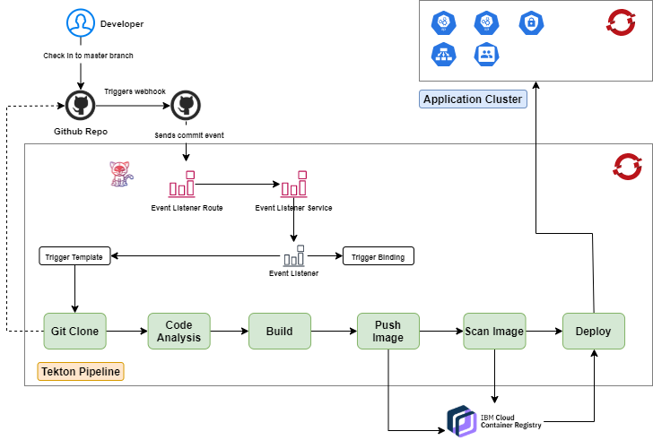

# Automated Build & Deployment - Openshift Pipelines (Tekton)

## Table of Contents

1. Prerequisite
2. New Openshift project under your cluster
3. IBM Github Enterprise connection with Openshift Pipeline
4. Tasks
5. Pipeline
6. Pipeline Run
7. Webhook
8. Trigger Bindings and Template
9. Setup

## Prerequisite

For this Openshift pipeline setup, we will need:
1. IBM Github login and access to the code repository
2. Access to Openshift cluster 
3. Openshift Pipeline operator installed from Operator Hub

## New Openshift project under your cluster

Your Openshift cluster may have one or more projects to run multiple applications. Recommended pattern is to create a new project in your cluster named `devops` and put all your project pipelines to a single project so that we are able to reuse the pipeline template tasks, triggers etc.

## IBM Github Enterprise connection with Openshift Pipeline

1. Create a secret to link your Github profile access to Openshift Pipeline. 
2. This can be done by going to `github.ibm.com -> Your Profile -> Settings -> Developer Settings -> Personal Access Tokens` and "Generate new token".
3. Update your Github IBM email-id as `username` and generated token as `password` in the sample reference Secret file - `Secrets/ibm-github-secret.yaml`


## The flow

We are going to build the following flow to integrate Github with Openshift Pipelines and subsequent build and deploy to Openshift cluster.




## Tasks

The pipeline consists of one or more tasks and for our demonstration, we have broken down into 3 distinct tasks:
1. Cloning GIT repository
2. Build, test and code scan for Maven projects
3. Build and push image to container registry
4. Scan the image for vulnerabilities (CVS)
5. Deploy image to a Kubernetes cluster

Create a new project
```
$ oc new-project pipelines-tutorial

OpenShift Pipelines automatically adds and configures a ServiceAccount named pipeline that has sufficient permissions to build and push an image.

$ oc get serviceaccount pipeline
```
## Webhook

Webhook is required to integrate Github events (like pull request, merge) with Openshift Pipelines for build & deployment process.
Create a Tekton Trigger Webhook. The webhook will execute the pipeline upon the merge of a pull request / checkin to master branch.
First step is to expose public service and route which will enable external apps (like Github) to send events through that service.

`oc apply -f .\pipelines\triggers\`

This will create an `EventListener`, `EventListenerRoute`, `TriggerBinding` and `TriggerTemplate` resource.
The `EventListener` resource will create result in the creation of a `Deployment` and `Service`. `EventListenerRoute` will generate a route.

Retrieve the route URL of the eventlistener: `oc get routes`
This route URL will now to be added to the Webhook in GitHub project.

Here we are referring to the `smq-data-producer-app` project to create this webhook.

Go to: https://github.ibm.com/apmmcontainerization/smq-data-producer-app/settings/hooks and follow the steps below:

Payload URL = http://<Route of Eventlistener>
Content type = application/json

Which events would you like to trigger this webhook? = Send me everything
click Add Webhook.


### Trigger Binding
This was already executed before but needs to be updated if you want to capture specific events like `pull requests` and not everything as we are doing in this guide.
This configuration is also important as it maps between the attributes from Github event playload to the `params` used in Trigger Template (next in this) so that the Pipeline tasks get the correct values in each of the params.
Refer to our [example:](https://github.ibm.com/apmmcontainerization/smq-data-producer-app/blob/master/tekton-pipelines/WebHook/triggerBinding.yaml)
Example:
`  - name: gitUrl
    value: $(body.repository.url)
`
This maps `gitUrl` param with the attribute `body.repository.url` from Github event playload.

### Trigger Template

This configuration links the resources to the Pipeline we had created earlier in this guide.
This Yaml has two distinct sections:

#### params:

Defines the parameters which are required to accept events from Github and then trigger the pipeline through the resourcetemplate `PipelineRun`

In our [example](https://github.ibm.com/apmmcontainerization/smq-data-producer-app/blob/master/tekton-pipelines/WebHook/triggerTemplate.yaml), we are using the following with default values wherever required:
`gitUrl`
`gitRepo`
`serviceAccountName`
`imageContext`
`imageTag`

#### resourcetemplates:

Here we define the PipelineRun resource which triggers the Pipeline with "definite" input for params. If there is no integration with source code repo, you can also define `PipelineRun` resource separately. Refer the [template](https://github.ibm.com/apmmcontainerization/pipelines/blob/master/pipeline/appname-pipeline-run.yaml) here.

In this case, we define the `PipelineRun` resource as part of `TriggerTemplate`. You can refer the example [here](https://github.ibm.com/apmmcontainerization/smq-data-producer-app/blob/master/tekton-pipelines/WebHook/triggerTemplate.yaml) done for a specifc project.

## Setup

For Openshift cluster having multiple projects, recommended pattern is:
1. Create a separate project/namespace for devops in the Openshift cluster
2. Setup SonarQube to run as a container in this new project/namespace using 
3. Create all `template` tasks/resources"
    - pipelines/setup/ibm-github-secret.yaml
    - pipelines/setup/ibmcloud-apikey.yaml
    - pipelines/setup/configmap.yaml
    - pipelines/setup/sonarqube.yaml
    - pipelines/setup/pipeline-account.yaml
    - pipelines/tasks/shared-pipeline-pvc.yaml
    - pipelines/tasks/git-clone-task.yaml
    - pipelines/tasks/java-maven-sonar.yaml
    - pipelines/tasks/build-and-pushimage-task.yaml
    - pipelines/tasks/ibm-img-scan.yaml
    - pipelines/tasks/deploy-using-kubectl-task.yaml
NOTE: these all are common to all projects inside the same cluster - so ONE time only
3. Create `project specific` configurations separately (refer: project `smq-data-producer-app`):
    - Create pipeline: 
        smq-data-producer-app/tekton-pipelines/Pipeline/smq-data-producer-build-and-deploy-pipeline.yaml
    - Create webhook & triggers: 
        smq-data-producer-app/tekton-pipelines/WebHook/eventListener.yaml
        smq-data-producer-app/tekton-pipelines/WebHook/eventListenerRoute.yaml
        smq-data-producer-app/tekton-pipelines/WebHook/triggerBinding.yaml
        smq-data-producer-app/tekton-pipelines/WebHook/triggerTemplate.yaml

NOTE: 
1. In case and ONLY IF, your project/app requires priviledge to create directories on deployment, take note of the followign example:

For the `smq-data-producer-app`, we have a privilged service account defined as `controlplane` under `apmm-cp4a-demo` project. 
#### If the pod doesn't require `Privileged` access and can work under default restricted service account then no need to copy the SA. Otherwise follow below steps to copy the SA to desired project and use the same in deploy.yaml

```
oc get sa controlplane -n apmm-cp4a-demo -o yaml
	apiVersion: v1
	imagePullSecrets:
	- name: controlplane-dockercfg-cr44n
	kind: ServiceAccount
	metadata:
	name: controlplane
	namespace: apmm-cp4a-demo
	secrets:
	- name: controlplane-token-8cqwh
	- name: controlplane-dockercfg-cr44n
```
`oc get sa controlplane -n apmm-cp4a-demo -o yaml | sed 's/apmm-cp4a-demo/devops/g' | oc create -n devops -f -`

`oc get secret controlplane-token-8cqwh -n apmm-cp4a-demo -o yaml | sed 's/apmm-cp4a-demo/devops/g' | oc create -n devops -f -`

`oc get secret controlplane-dockercfg-cr44n -n apmm-cp4a-demo -o yaml | sed 's/apmm-cp4a-demo/devops/g' | oc create -n devops -f -`

## Further Reading & Reference:

1. Tekton Beta tutorial: https://github.com/IBM/tekton-tutorial/tree/beta-update
2. Openshift tutorial: https://github.com/openshift/pipelines-tutorial
3. IBM Cloud Architecture Openshift Pipeline guide: https://github.com/ibm-cloud-architecture/gse-devops
4. Tekton Triggers: https://github.com/tektoncd/triggers
5. IBM Cloud Architetcure tutorials: https://ibm-cloud-architecture.github.io/tutorials/
6. IBM CLoud Architecture Tekton tutorial: https://github.com/ibm-cloud-architecture/tutorial-tekton-pipeline

